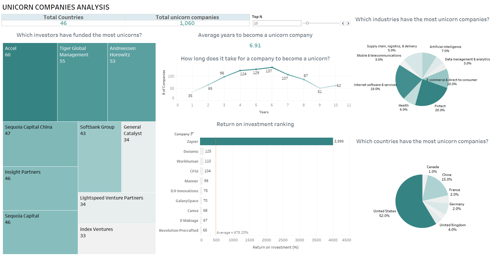

This project aims at exploring the answers to the following questions:

- Which unicorn companies have had the biggest return on investment?
- How long does it usually take for a company to become a unicorn?
- Which industries have the most unicorns?
- Which countries have the most unicorns?
- Which investors have funded the most unicorns?

DashBoard Picture -

